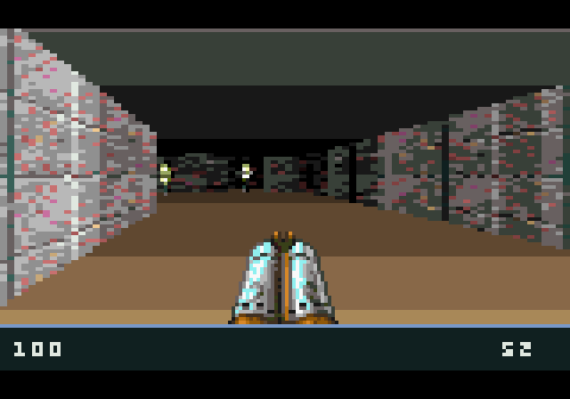
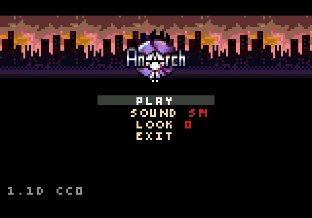

# Anarch for the Sega Saturn

Sega saturn port by gameblabla (2023)

This is a quick an dirty port of Anarch Miloslav Ciz (drummyfish) for the Sega Saturn.

The hardware is actually not bad for doing software rendering, although the wide framebuffer
can cause issues but we need to double buffer anyway...

This is still WIP as there is no music or sound effects but the game is already playable.
This is supposed to be flashed to a Saturn cartridge.

